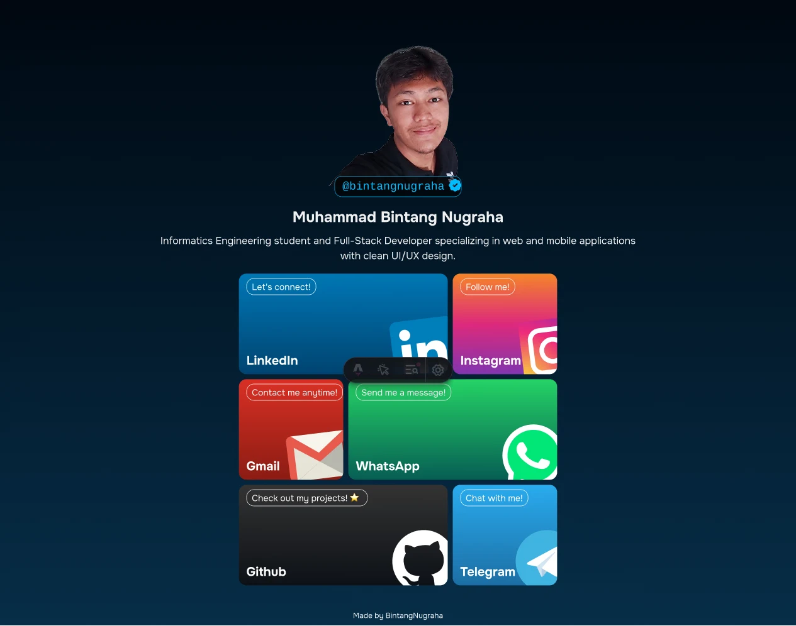

# Muhammad Bintang Nugraha


A lightweight personal links website built with Astro and Tailwind CSS. It presents a short profile, branded social link cards, and essential contact channels in a clean, responsive layout.



## Overview

This project is designed as a fast, static, and easy-to-maintain personal landing page for Muhammad Bintang Nugraha. Most of the site content is managed from `src/data.json`, so profile details, metadata, colors, and social links can be updated without changing the component structure.

## Features

- Built with Astro 5 for fast static-site performance.
- Styled with Tailwind CSS 4 through the official Vite plugin.
- Centralized content configuration through `src/data.json`.
- Responsive layout for mobile, tablet, and desktop screens.
- Branded social cards with custom gradients and hover interactions.
- Local Onest font files for consistent typography.
- Clean import aliases using `@/*`.

## Tech Stack

- [Astro](https://astro.build/) as the static site framework.
- [Tailwind CSS](https://tailwindcss.com/) for utility-first styling.
- TypeScript with Astro's strict configuration.
- Bun or pnpm for dependency management.

## Project Structure

```text
.
+-- public/
|   +-- fonts/              # Local font files
|   +-- *.svg               # Social icons and favicon
|   +-- photo.webp          # Profile photo
|   +-- screenshot-2026.webp
+-- src/
|   +-- assets/             # Internal Astro assets
|   +-- components/         # Page components
|   +-- layouts/            # Main HTML layout
|   +-- pages/              # Astro page entry
|   +-- styles/             # Global CSS and Tailwind import
|   +-- data.json           # Website content configuration
+-- astro.config.mjs
+-- package.json
+-- tsconfig.json
```

## Installation

Clone the repository, then install the dependencies with your preferred package manager.

```bash
# Using Bun
bun install

# Or using pnpm
pnpm install
```

## Development

```bash
# Bun
bun run dev

# pnpm
pnpm dev
```

After the development server starts, open the local URL shown in your terminal. By default, Astro usually runs at:

```text
http://localhost:4321
```

## Production Build

```bash
# Bun
bun run build

# pnpm
pnpm build
```

The production-ready static files will be generated in the `dist/` directory.

To preview the production build locally:

```bash
# Bun
bun run preview

# pnpm
pnpm preview
```

## Content Configuration

Most of the website content is configured in `src/data.json`.

```json
{
  "html": {
    "title": "Muhammad Bintang Nugraha",
    "description": "Follow me on all my socials"
  },
  "header": {
    "image": "/photo.webp",
    "username": "@bintangnugraha"
  },
  "about": {
    "name": "Muhammad Bintang Nugraha",
    "summary": "Informatics Engineering student and Full-Stack Developer..."
  }
}
```

To add or update social links, edit the `links` array in the same file:

```json
{
  "network": "LinkedIn",
  "message": "Let's connect!",
  "url": "https://www.linkedin.com/in/bintangnugraha",
  "logo": "/LinkedIn.svg",
  "topColor": "#0077B5",
  "middleColor": "",
  "bottomColor": "#004471"
}
```

Note: `Links.astro` currently renders six social links across three grid rows. If you want the number of links to be fully dynamic, update the rendering logic in `src/components/Links.astro`.

## Asset Customization

- Replace the profile photo at `public/photo.webp`.
- Replace the README preview image at `public/screenshot-2026.webp`.
- Add new social icons to the `public/` directory.
- Customize the page background with `html.topColor` and `html.bottomColor`.
- Customize each social card using `topColor`, `middleColor`, and `bottomColor`.

## Scripts

| Command | Description |
| --- | --- |
| `bun run dev` / `pnpm dev` | Start the development server |
| `bun run build` / `pnpm build` | Create a production build |
| `bun run preview` / `pnpm preview` | Preview the production build locally |
| `bun run astro` / `pnpm astro` | Run Astro CLI commands |

## Deployment

Because this project builds to static files, the generated `dist/` directory can be deployed to services such as:

- Vercel
- Netlify
- Cloudflare Pages
- GitHub Pages
- Shared hosting that supports static files

Use `bun run build` or `pnpm build` as the build command, then set the output directory to `dist`.

## Credits

Created and maintained by [Muhammad Bintang Nugraha](https://bintangnugraha.my.id).

## License

No public license has been defined for this repository yet. Add a `LICENSE` file if the project will be opened for public use or contribution.
